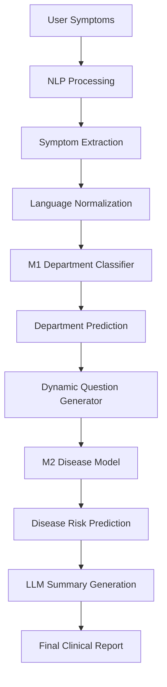
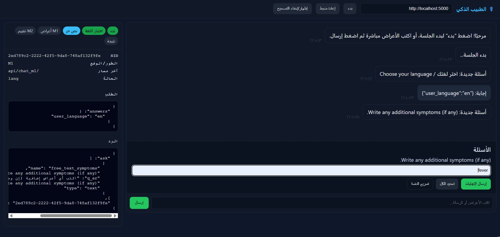
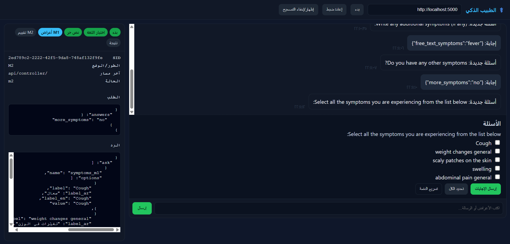
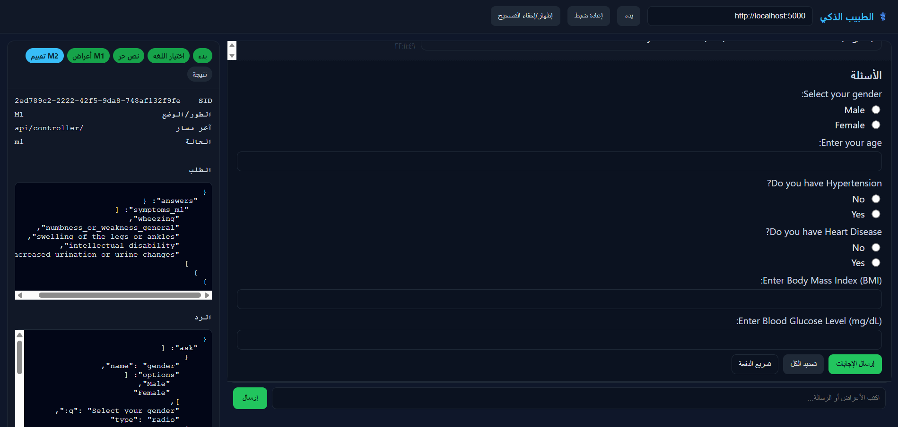
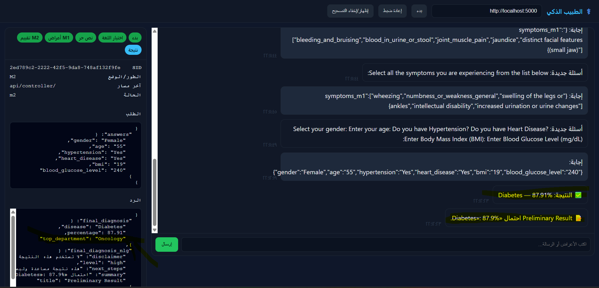

# SmartClinic AI

### Intelligent Bilingual Healthcare Diagnostic System Powered by Machine Learning and NLP

<p align="center">

  
  
  
  
  
  

</p>

<p align="center">
AI-powered clinical decision support system combining ensemble machine learning,
bilingual NLP, and intelligent conversational diagnostics.
</p>

---

# Overview

SmartClinic AI is a bilingual healthcare diagnostic assistant designed to support preliminary clinical decision-making using conversational symptom analysis and machine learning.

The system combines:

* Ensemble Machine Learning
* Conversational NLP
* Arabic and English language support
* Disease risk prediction
* LLM-enhanced symptom understanding

The platform follows a two-stage diagnostic pipeline:

| Stage | Description                                               |
| ----- | --------------------------------------------------------- |
| M1    | Medical department and specialty classification           |
| M2    | Disease-specific prediction inside the selected specialty |

---

# Core Features

## Intelligent ML Pipeline

* Multi-stage healthcare classification system
* Ensemble learning architecture
* Feature importance-guided questioning
* Context-aware symptom refinement
* Confidence-based predictions

## Arabic and English NLP

* Bilingual conversational interaction
* Arabic medical synonym normalization
* English symptom extraction
* Negation detection
* Language-aware responses

## LLM Integration

Integrated with OpenRouter APIs for:

* Symptom normalization
* Fallback NLP extraction
* AI-generated summaries
* Conversational response enhancement

## Interactive Clinical Workflow

* Free-text symptom input
* Dynamic follow-up questions
* Checkbox-based refinement
* Context-aware question generation
* Personalized interaction flow

## Explainable Predictions

* Disease probability scores
* Department classification confidence
* Feature importance tracking
* Transparent prediction pipeline

---

# System Architecture



---


---

# Project Demo

This section demonstrates the real workflow of SmartClinic AI from symptom input to final prediction.

---

## M1 - Step 1: Symptom Analysis Flow

<p align="center">
  
</p>

---

## M1 - Step 2: Dynamic Questioning System

<p align="center">
  
</p>

---

## M2 - Disease Prediction Stage

<p align="center">
  
</p>

---

## Final Diagnosis Result

<p align="center">
  
</p>

---

# Machine Learning Architecture

## M1 — Department Classification

The first-stage classifier predicts the most relevant medical department based on extracted symptoms.

### Algorithms Used

* Random Forest
* Extra Trees
* Gradient Boosting
* CatBoost
* XGBoost
* LightGBM

### Additional Techniques

* Weighted ensemble blending
* Probability calibration
* Feature importance ranking
* SMOTE oversampling
* RandomizedSearchCV optimization

### Output

Predicts one of multiple medical specialties including:

* Cardiology
* Neurology
* Dermatology
* Respiratory
* Gastroenterology
* Orthopedics
* Psychiatry
* Infectious Diseases
* Internal Medicine

---

## M2 — Disease-Specific Prediction

After department classification, specialized disease models are used for deeper analysis.

### Current Disease Models

| Disease       | Model Type             |
| ------------- | ---------------------- |
| Heart Disease | RandomForestClassifier |
| Diabetes      | RandomForestClassifier |
| COVID-19      | RandomForestClassifier |
| Osteoporosis  | RandomForestClassifier |

---

# NLP Pipeline

The NLP system combines rule-based extraction with LLM-assisted fallback mechanisms.

## Processing Flow

```text
User Input
   ↓
Regex Extraction
   ↓
Arabic/English Synonym Matching
   ↓
Negation Detection
   ↓
Canonical Symptom Mapping
   ↓
LLM Fallback Extraction
```

## Supported NLP Features

* Arabic medical terminology normalization
* English symptom extraction
* Negation handling
* Context-aware interpretation
* Synonym expansion
* Bilingual interaction support

---

# Project Structure

```bash
SmartClinic-AI/
│
├── app/
│   ├── controller.py
│   ├── core.py
│   ├── agents_nlp.py
│   ├── llm_utils.py
│   └── templates/
│       └── index.html
│
├── models/
│   ├── m1/
│   └── m2/
│
├── data/
│
├── tests/
│
├── docs/
│
├── requirements.txt
├── run.py
├── .env.example
├── .gitignore
├── LICENSE
└── README.md
```

---

# Installation

## Clone Repository

```bash
git clone https://github.com/abdallah-samhan/SmartClinic-AI.git
cd SmartClinic-AI
```

---

## Create Virtual Environment

### Windows

```bash
python -m venv venv
venv\Scripts\activate
```

### Linux / macOS

```bash
python3 -m venv venv
source venv/bin/activate
```

---

## Install Dependencies

```bash
pip install -r requirements.txt
```

---

## Configure Environment Variables

Create a `.env` file:

```env
OPENROUTER_API_KEY=your_api_key_here
```

---

## Run Application

```bash
python run.py
```

Application will run on:

```text
http://127.0.0.1:5000
```

---

# API Endpoints

| Endpoint                       | Description          |
| ------------------------------ | -------------------- |
| POST `/api/start_consultation` | Start new session    |
| POST `/api/ask`                | Submit symptoms      |
| POST `/api/answer_question`    | Submit answers       |
| POST `/api/get_result`         | Retrieve predictions |

---

# Datasets

| Dataset                          | Purpose                      |
| -------------------------------- | ---------------------------- |
| grouped_by_department_merged.csv | Department classification    |
| heart.csv                        | Heart disease prediction     |
| diabetes.csv                     | Diabetes prediction          |
| osteoporosis.csv                 | Osteoporosis prediction      |
| Covid.csv                        | COVID-19 prediction          |
| ar_synonyms_medical.csv          | Arabic symptom normalization |

---

# Performance

| Metric                 | Score |
| ---------------------- | ----- |
| M1 Cross Validation F1 | 0.98  |
| M1 Test Accuracy       | 85.3% |
| Weighted F1 Score      | 0.85  |

---

# Technologies Used

## Backend

* Flask
* Flask-CORS

## Machine Learning

* Scikit-learn
* XGBoost
* LightGBM
* CatBoost
* imbalanced-learn

## NLP

* OpenRouter API
* Mistral 7B
* Regex-based extraction
* Arabic synonym matching

## Data Processing

* Pandas
* NumPy

## Frontend

* HTML
* CSS
* Vanilla JavaScript

---

# Security

## Important Notes

* API keys are stored using environment variables
* `.env` files are ignored by git
* Input validation implemented on API layer
* No credentials stored inside source code

---

# Development

## Run Tests

```bash
python tests/test_core.py
```

---

## Retrain Models

```bash
cd models/m1
python m1.py
```

---

# Future Improvements

* Additional disease-specific models
* Transformer-based medical NLP
* Docker deployment
* Mobile application
* Electronic Health Record integration
* Real-time monitoring dashboard
* Telemedicine integration

---

# Contributing

Contributions are welcome.

1. Fork repository
2. Create feature branch
3. Commit changes
4. Push branch
5. Open Pull Request

---

# License

This project is licensed under the MIT License.

---

# Medical Disclaimer

SmartClinic AI is a research and educational project only.

The system is not intended to replace professional medical diagnosis, treatment, or clinical judgment. Always consult qualified healthcare professionals before making medical decisions.

---

# Author

Developed by Abdallah Samhan

GitHub:
[https://github.com/abdallah-samhan](https://github.com/abdallah-samhan)
